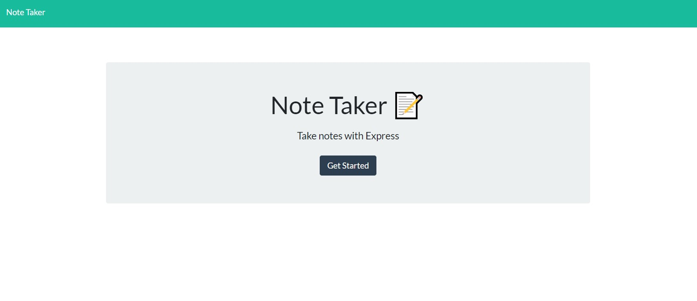

# Note Tracker

As a small business owner I want to be able to write and save notes, so that I can organize my thoughts and keep track of tasks I need to complete.

## Table of Contents
* [Npm Packages](#Npm-Packages)
* [Usage](#Usage)
* [Test](Test)
* [Questions](#Questions)

## Npm Packages 
><b>Required to run this application:</b>
* Express 
* Fs
* uuid
* Util
 

## Usgae
Once you load the deployed application, you can click the "Get Started" button to begin. Now you can create a new note, and veiw/delete a previous note. Once you've created your note title and description, you can click the "+" button to add your new note. You must create a note title and description when creating a new note.

## Test
screen shot below:</b>

example of how application works:</b>

 

## Questions
Do you have questions? Contact me here:
* [Github](https://github.com/jameleggleston)
* [Email](jamel.eggleston@gmail.com)

### Application
Here's the link for the deployed application hosted on [Heroku](https://vast-tundra-17769.herokuapp.com/). 

[Back to top](#Note-Taker)